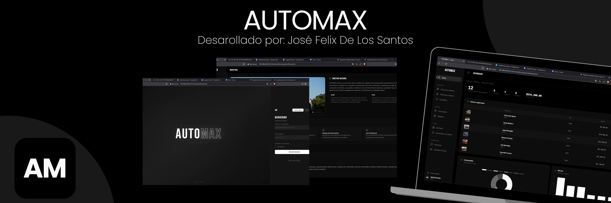

# AUTOMAX — DealerShip Management System

## Academic Information

**Course:** Programming III

**Professor:** Emilio Peña

**University:** Universidad Católica del Cibao (UCATECI)

**Student:** José Felix DLS

**Student ID:** 2024-1135

   

## Project Objective

[adapted: Full-stack dealership management web app for inventory, branches, users, and analytics]

## Description

[adapted: Built with Node.js + Express + PostgreSQL backend, SPA frontend with vanilla JS]

## Included Modules

* **Dashboard & Analytics:** Real-time statistics, interactive charts (fuel/brands/year value), branch filter.
* **Inventory Management:** Full CRUD, table/card views, advanced filters, image upload, PDF export.
* **Branch Management:** Color-coded branches, CRUD, employee assignment, PDF reports.
* **User Administration:** Role-based access (admin/gerente/empleado), inline role/branch editing, account toggle.
* **Profile & Preferences:** Avatar upload, password change, activity stats chart, language toggle (ES/EN), default view preference.
* **Virtual Assistant (Chatbot):** Natural language queries, brand/price/condition detection, quick-action buttons.
* **Registration Wizard:** 2-step vehicle registration with auto-code generation and color swatches.
* **About Us Page:** Image carousel, company history, mission/vision, interactive feature showcase.

## Features

[adapted: 12 features covering guest mode, SPA routing, bilingual, PDF, charts, etc.]

## Technologies Used

* HTML5, CSS3 (Flexbox/Grid, custom properties)
* Vanilla JavaScript (ES6+, DOM, localStorage, fetch API)
* Node.js + Express 5 (REST API)
* PostgreSQL (3 tables: usuarios, sucursales, vehiculos)
* Chart.js, jsPDF + autoTable, Lucide Icons
* JWT, bcrypt, Multer

## Project Status

Completed academic project developed for educational purposes.
